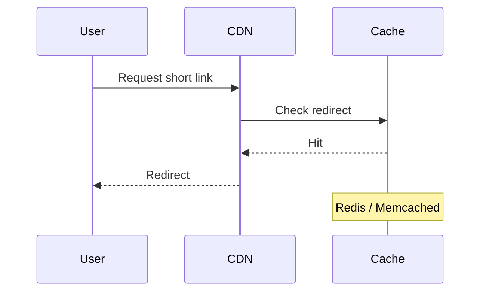

# Showcase

---

# Building a Distributed URL Shortener

> A deep dive into designing a scalable URL shortening service similar to Bitly or TinyURL.


# Overview

A **URL Shortener** converts long URLs into short, shareable links.

Example:

```
https://example.com/articles/building-a-scalable-url-shortener
```

becomes:

```
https://sho.rt/aZ91K
```

When a user visits the short URL, the service **redirects them to the original URL**.

---

# Why URL Shorteners Exist

1. Shareable links
2. Analytics tracking
3. Link expiration
4. Branding
5. Reduced character count

---

# System Requirements

## Functional Requirements

- Create short URLs
- Redirect to original URL
- Track analytics
- Optional expiration

## Non-Functional Requirements

| Requirement  | Description             |
| ------------ | ----------------------- |
| Latency      | < 50ms redirect         |
| Availability | 99.99% uptime           |
| Scale        | 100M URLs               |
| Security     | Prevent malicious links |

---

# Architecture

User --> CDN
CDN --> LoadBalancer
LoadBalancer --> API
API --> Database
API --> Cache
API --> Analytics

# Database Schema

```sql
CREATE TABLE urls (
  id BIGSERIAL PRIMARY KEY,
  short_code VARCHAR(10) UNIQUE NOT NULL,
  original_url TEXT NOT NULL,
  created_at TIMESTAMP DEFAULT NOW(),
  expires_at TIMESTAMP
);
```

---

# API Design

## Create Short URL

```
POST /api/shorten
```

Request

```json
{
  "url": "https://example.com/very-long-link"
}
```

Response

```json
{
  "shortUrl": "https://sho.rt/abc123"
}
```

---

## Redirect

```
GET /:shortCode
```

Returns HTTP redirect:

```
302 Found
Location: https://example.com/very-long-link
```

---

# Key Algorithms

## Base62 Encoding

To create short links we encode IDs into **Base62**.

```
0123456789abcdefghijklmnopqrstuvwxyzABCDEFGHIJKLMNOPQRSTUVWXYZ
```

Example:

```
125 → cb
```

### Pseudocode

```ts
function encodeBase62(num: number): string {
  const chars =
    "0123456789abcdefghijklmnopqrstuvwxyzABCDEFGHIJKLMNOPQRSTUVWXYZ";

  let result = "";

  while (num > 0) {
    result = chars[num % 62] + result;
    num = Math.floor(num / 62);
  }

  return result;
}
```

---

# Scaling Challenges

## Hot Keys

Some links become extremely popular.

Solution:

- CDN caching
- Redis caching

---

## Database Bottlenecks

Possible strategies:

- Sharding
- Read replicas
- Caching layer

---

# Cache Strategy



---

# Code Examples

## Node.js Example

```ts
import express from "express";

const app = express();

app.get("/:code", async (req, res) => {
  const url = await db.get(req.params.code);

  if (!url) {
    return res.status(404).send("Not found");
  }

  res.redirect(url.original);
});
```

---

## React Analytics Dashboard

```tsx
export function Stats({ clicks }: { clicks: number }) {
  return (
    <div>
      <h2>Total Clicks</h2>
      <strong>{clicks}</strong>
    </div>
  );
}
```

---

# Task List (Feature Roadmap)

- [x] Short URL generation
- [x] Redirect service
- [ ] Analytics dashboard
- [ ] Custom branded URLs
- [ ] QR code generation

---

# Configuration Example

```yaml
service:
  name: url-shortener

database:
  host: localhost
  port: 5432

cache:
  provider: redis
  ttl: 3600
```

---

# Math (Hash Distribution)

A simple hash distribution formula:

$$
hash(key) = key \mod N
$$

Where:

- `key` = URL ID
- `N` = number of shards

---

# Alerts / Notes

> **Note**
> Redirect endpoints should be extremely fast.

> **Warning**
> Always validate URLs to prevent malicious redirects.

---

# Collapsible Section

<details>

<summary>Click to reveal advanced optimization techniques</summary>

### Advanced Techniques

- Bloom filters
- Consistent hashing
- Edge redirects

</details>

---

# Image Example


# Footnotes

Short URLs must remain unique. This can be guaranteed with a **unique index**.[^1]

[^1]: Most production systems also include retry logic.

---

# HTML Blocks

<div align="center">

### System Design Philosophy

> Simplicity scales better than complexity.

</div>

---

# Quick Comparison

| Service     | Open Source | Distributed |
| ----------- | ----------- | ----------- |
| Bitly       | ❌          | ✅          |
| TinyURL     | ❌          | ❌          |
| Self-Hosted | ✅          | Depends     |

---

# Conclusion

A distributed URL shortener demonstrates many important **system design concepts**:

- hashing
- caching
- sharding
- distributed systems
- analytics pipelines

These principles apply to many real-world systems like:

- social media
- content delivery networks
- large-scale APIs

---

⭐ If you enjoyed this article, consider exploring:

- distributed caching
- consistent hashing
- rate limiting algorithms

---
